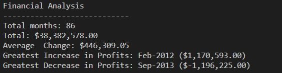
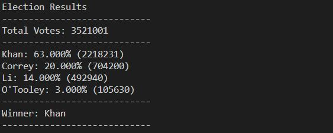

## Python - The VBA of Wall Street

### Analyzing the financial records of a company

* [Python script](PyBank/main.py) that analyzes the records to calculate net total amount, changes over the period and it average, greatest increase in profits and greatest decrease in losses.

# Results

### Rural town modernize its vote counting process

* [Python script](PyPoll/main.py) that analyzes the votes and calculates the percentage of votes each candidate and the winner.

# Results

